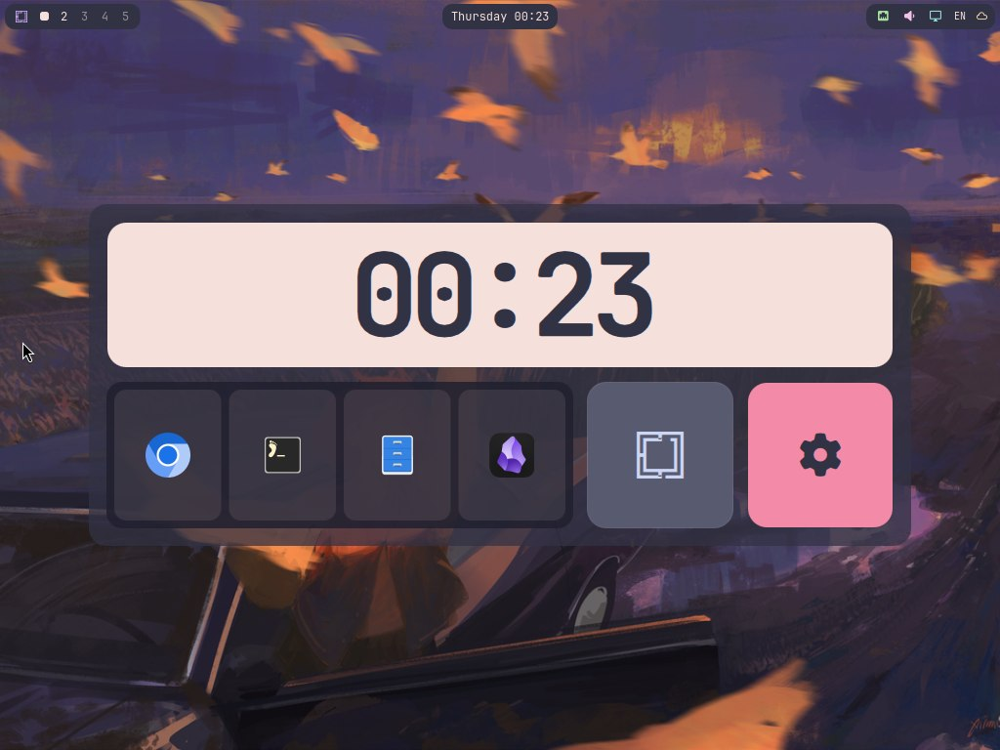

# Home Zone

[English](README.md) · [Russian](README.ru.md)



A theme-aware desktop dashboard for **Omarchy** (Arch Linux, Hyprland, and
quickshell). Home Zone provides a large clock, a compact launcher for selected
applications, an Omarchy system-menu button, and a dedicated settings button.

The built-in settings window lets you select zero to four launcher applications,
move tiles, and resize them from any edge or corner within a fixed `10 × 4` grid.
Application selection is applied immediately, while Save and Cancel control the
layout draft. The finer grid improves resize precision without changing the
established `842 × 350` outer size.

Every surface follows the active Omarchy theme by default through live roles such
as `Color.accent`, `Color.bar.*`, `Color.muted`, `Color.urgent`, and
`Color.background`. The plugin does not ship a hard-coded CanvasTTY palette.

Plugin ID: `io.github.howdeploy.home-zone`

## Installation

```bash
omarchy plugin add https://github.com/howdeploy/omarchy-home-zone.git --enable
```

The command clones the repository into
`~/.config/omarchy/plugins/io.github.howdeploy.home-zone/`, validates the
manifest, and enables the plugin. The user configuration is created
when settings are first saved; until then, Home Zone uses its built-in defaults.

## Updating

```bash
omarchy plugin update io.github.howdeploy.home-zone
```

Updates are verified fast-forwards. If the installed plugin directory contains
local changes, the update is rejected until those changes are removed or
committed.

## Uninstalling

```bash
omarchy plugin remove io.github.howdeploy.home-zone
```

The user configuration at `~/.config/omarchy/home-zone.json` is preserved and
can be removed manually if it is no longer needed.

## Development

`install.sh` is a **development helper; the official Omarchy plugin installer
does not run it**. It synchronizes the repository working tree into the plugin
directory for fast local iteration. The helper backs up an existing development
installation and refuses to overwrite a Git checkout installed with
`omarchy plugin add`.

```bash
./install.sh
```

## Configuration

Home Zone watches `~/.config/omarchy/home-zone.json` and reloads it without a
shell restart.

| Key | Purpose |
|---|---|
| `grid.columns / cellWidth / cellHeight / gap` | Grid geometry |
| `card.visible / backgroundAlpha / radius / padding` | Outer card |
| `colors.<widget>Background / <widget>Text` | Per-widget theme-role override for `clock`, `launcher`, `menu`, or `settings` |
| `colors.tileBackground / text / cardBackground` | Shared compatibility override on top of the system theme |
| `colors.launcherTile / border` | Launcher-button and tile-border overrides |
| `tiles[]` | Tile definitions: `widget`, `col`, `row`, `colspan`, `rowspan`, and `settings` |

The launcher's `settings.appIds` value stores an ordered list of desktop IDs. If
the key is absent, Home Zone displays the first four applications from
`shell.appLibrary`. An explicit empty array, `appIds: []`, produces an empty
launcher and does not trigger the fallback.

## Dependencies

- Omarchy with its quickshell-based shell (`omarchy-shell`).
- The `menu` tile summons Omarchy's system menu through
  `omarchy-shell shell summon omarchy.menu`.

## License

MIT. See [LICENSE](LICENSE).

## Documentation

- [Architecture and plugin lifecycle](docs/ARCHITECTURE.md)
- [Writing a Home Zone widget](docs/widget-authoring.md)
